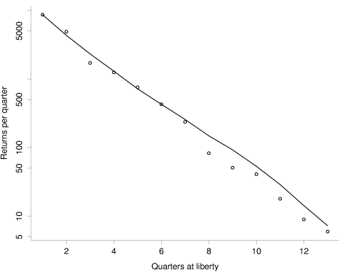

# Outline
This course is an introduction for DG MARE desk Officers and other officials to the current state of the art in Quantitative Fisheries Science (QFS), as applied at different RFMO scientific bodies, with special emphasis on the solutions used by the various tuna RFMOs.

Topics covered are current practice in stock assessment, provision of quantitative advice and evaluation through simulation of alternative management plans, will be presented using recent examples.

```{r, eval=TRUE, echo=FALSE}
knitr::opts_chunk$set(echo = FALSE)

library(knitr)

opts_chunk$set(comment=NA, 
               warning=FALSE, 
               message=FALSE, 
               error  =FALSE, 
               echo   =FALSE, 
               eval   =!TRUE,
               fig.width =4, 
               fig.height=4)

iFig=0
iTab=0
```

```{r init, eval=TRUE}
library(plyr)
library(ggplot2)
library(kobe)
library(reshape2)

dirMy="D:/Repository/DGMARETuna/tutorials/advice_framework"
#dirMy="/home/laurie/Desktop/flr/tutorials/advice_framework"
dirTex=file.path(dirMy,"tex")
dirDat=file.path(dirMy,"data")

load(file.path(dirDat,"yft.RData"))
load(file.path(dirDat,"jjm.RData"))

```

# Assessment Models and data requirements

|                    | Biomass   | ASPM      | VPA       | SS        | 
| -------------------|:---------:|:---------:|:---------:|:---------:|  
| Catch Biomass      |     x     |    x      |           |    x      | 
| Effort             |     x     |           |           |    x      |    
| Relative abundance |           |           |    x      |           |  
| CPUE               |     x     |           |    x      |    x      |  
| Catch-at-size      |           |     x     |           |           |  
| Catch-at-age       |           |           |    x      |           |  
| Growth             |           |     x     |           |    x      |  
| Fecundity          |           |           |           |    x      |  
| Natural Mortality  |           |     x     |    x      |    x      |  
| Migration          |           |           |           |           |  
| Stock Structure    |           |           |           |           |  
|                    |           |           |           |           |  


### Catch / Landings Biomass

Landings or catch data comprises all the fisheries catch that is brought into harbour / put on-land. Owing to transshipments, the fishing vessel itself does not need to land it, but is it possible to transfer fish at sea to vessels more equipted to transport rather than fish. This leaves more time for fishing vessels to fish at sea given the large distances they would otherwise have to steam to harbour.  


**Figure `r iFig=iFig+1; iFig`.** Transshipment of fish at the high seas.

Often, fish landed is only the marktable fish, but under the new landing obligation, it is also the smaller fish with limited value. In the end, fish can go directly to canneries, is kept in frozen storage, or is sold via retailers / sold directly to e.g. restaurant owners. 


**Figure `r iFig=iFig+1; iFig`.** Tuna at a fish market in Hawaii

Depending on local legislation or RFMO rules, landings data is reported by the skipper in logbooks. These logbooks also contain information on the location of the catch, the catch position and details on the vessel such as horsepower of th engine and gear used to catch the fish. The information in these logbooks is reported to the autorities (CPCs) who could collate all this information. Not all of this information is send to fisheries scientists however to be used for stock assessment activities. Often, only highly aggregated catch data is available for stock assessment purposes.  

The landing / transshipment declarations are also used to keep track of quota uptake, and the same autorities report back to skippers on how much quota is left. 

For stock assessment purposes, the landings data play a very important role. Often, it is the only reliable source of information. Getting the landings data correct is therefore crucial. If the landings data is of bad quality, one can usually assume that the stock assessment does not represent the real stock status very well. That has all to do with the way stock assessment models work, in a sense, they try to reconstruct the catch time-series assuming certain biological processes take place. 

```{r, fig.height=3,fig.width=7, eval=TRUE}
  dat <- rbind(data.frame(fleet=1,year=1970:2016,catch=jjm$output$Stock_1$Obs_catch_1),
               data.frame(fleet=2,year=1970:2016,catch=jjm$output$Stock_1$Obs_catch_2),  
               data.frame(fleet=3,year=1970:2016,catch=jjm$output$Stock_1$Obs_catch_3),  
               data.frame(fleet=4,year=1970:2016,catch=jjm$output$Stock_1$Obs_catch_4)) 

cols <- rep(c("black","red","green","blue"),each=47)

ggplot(data=dat,aes(x=year,y=catch,group=fleet))+
  geom_line(aes(colour=cols))+
  theme_bw()+theme(legend.position="none")+
  ylab(expression("Catch by fleet (Tonnes)"))+
  xlab("Year")
```

**Figure `r iFig=iFig+1; iFig`.** Fish catch from 1970 - 2016 for 4 different fleets.

### Effort data
Effort time-series are one other data source often used for stock assessment (together with catch-per-unit-effort time-series). Effort can be expressed in many different ways and depends on the type of fishery and data available. For example:
* Searching time (for pelagic fish)
* Time out of harbour
* Time spend fishing (for trawlers)
* Length of the gear (for longline or passive gears)

For trawlers, effort can be derived rather straigh forward, but for purse seine fisheries fishing using FADs, effort is more difficult to estimate. In this case, searching time is not directly a useful indicator and the effort data needs to be treated first before it can be used for assessments. E.g. to split between the total searching time between conventional searching time and seaching time using radio beakened FADs. For longlining, effort may be expressed as the length of the line, the number of hooks attached, the time the line is in the water or a combination of these factors.  

### Relative abundance

Relative abundance data can be obtained from commercial vessels or research vessels and aim to get a representative age distribution for the entire population. Relative abundance data may show the decline of numbers of fish in a cohort over time and is used as an additional dataset next to catch data in stock assessment to estimate total population size. 
The relative abundance data, i.e. the actual numbers representing the time-series, are often several maginutes lower than the estimated total number of fish in the population. The link between these two is a factor called 'catchability'. If catchability is 10%, i.e. 0.1, it means that this specific abundance time-series was able to 'count' 10% of the actual population. In the stock assessment, the relative abundance is then multiplied with a factor 10 and contrasted with the catch data. 
Often however is the catchability not constant over time or constant over ages and this requires certain adaptations to the modelling framework to make sure the relative abundance is used properly. 

Relative abundance can also be obtained through e.g. an acoustic survey. Although these series are relatively common in Europe, in Tuna and other RFMO's they are scarce. Independent monitoring data is expensive to collect and when a stock is widely distributed, the efforts needed to cover the entire stock are enourmous. 


**Figure `r iFig=iFig+1; iFig`.** Fisheries independent acoustic survey results versus the estimated stock size.

### CPUE

Much more common in Tuna RFMOs is the use of Catch-Per-Unit-Effort data, because these data come straight from the fishing fleet. There is an assumption that whenever a fishing vessel catches more fish per unit of time, there is more fish in the sea. Although the CPUE data itself does not say how much fish there is, the change from year to year can be used as an indicator of changing biomass of fish all together. 

In CPUE, it is essential to correct for factors that affect the assumtpion that more fish per unit of effort is a descriptor of larger stock size. If, for example, fishermen can fish closer toy shore, because environmental conditions drive fish closer to shore, it means that less effort is needed to catch fish. However, this may not be an indicator for a larger stock. Similarly, if FADs are being used, fish aggregate and can be caught in an easier way that in the conventional searching and catching setup. This means that corrections to the CPUE need to be made when more FADs or more advanced signalling FADs are being used. 

```{r, fig.height=3,fig.width=7, eval=TRUE}
dat <- rbind(data.frame(survey="Chinese_CPUE",year=jjm$output$Stock_1$Obs_Survey_6[,1],data=jjm$output$Stock_1$Obs_Survey_6[,2]/mean(jjm$output$Stock_1$Obs_Survey_6[,2])),
             data.frame(survey="EU_CPUE",year=jjm$output$Stock_1$Obs_Survey_7[,1],data=jjm$output$Stock_1$Obs_Survey_7[,2]/mean(jjm$output$Stock_1$Obs_Survey_7[,2])),
             data.frame(survey="Russian_CPUE",year=jjm$output$Stock_1$Obs_Survey_8[,1],data=jjm$output$Stock_1$Obs_Survey_8[,2]/mean(jjm$output$Stock_1$Obs_Survey_8[,2])),
             data.frame(survey="Chilean_CPUE",year=jjm$output$Stock_1$Obs_Survey_3[,1],data=jjm$output$Stock_1$Obs_Survey_3[,2]/mean(jjm$output$Stock_1$Obs_Survey_3[,2])))
             #data.frame(survey=5,year=jjm$output$Stock_1$Obs_Survey_5[,1],data=jjm$output$Stock_1$Obs_Survey_5[,2]/mean(jjm$output$Stock_1$Obs_Survey_5[,2])),
             #data.frame(survey=6,year=jjm$output$Stock_1$Obs_Survey_6[,1],data=jjm$output$Stock_1$Obs_Survey_6[,2]/mean(jjm$output$Stock_1$Obs_Survey_6[,2])),
             #data.frame(survey=7,year=jjm$output$Stock_1$Obs_Survey_7[,1],data=jjm$output$Stock_1$Obs_Survey_7[,2]/mean(jjm$output$Stock_1$Obs_Survey_7[,2])),
             #data.frame(survey=8,year=jjm$output$Stock_1$Obs_Survey_8[,1],data=jjm$output$Stock_1$Obs_Survey_8[,2]/mean(jjm$output$Stock_1$Obs_Survey_8[,2])),
             #data.frame(survey=9,year=jjm$output$Stock_1$Obs_Survey_9[,1],data=jjm$output$Stock_1$Obs_Survey_9[,2]/mean(jjm$output$Stock_1$Obs_Survey_9[,2])))


ggplot(data=dat,aes(x=year,y=data,group=survey))+
  geom_point()+geom_line()+
  facet_grid(.~survey)+
  ylab(expression("Index by fleet"))+
  xlab("Year")     

```

**Figure `r iFig=iFig+1; iFig`.** CPUE series for a number of countries fishing for the same fish stock.

#### Catch at size / at length

In the data-limited situation of tuna RFMOs, individual length measurements are available, rather than age measurements which are more costly and time consuming to gather. 

These length observations can be converted to age data using an age-length key. Each length then corresponds, with a certain probablity, to an age-group. In some Tuna RFMOs, such as ICCAT, very old age-length keys are used. This can become problematic if growth of fish changes. We've seen that fish growth can vary substantially from year to year, may vary depending on food availability under influence of density-dependent processes. We've also observed that some fish species have gotten smaller due to high fishing pressure (smaller individuals may escape more easily from fishing gear and therefore individuals that carry genes to code for smaller body size have an advantage). Hence, using a fixed or old age-length key may therefore introduce error in the available age data. In the end, this may cause problems in trying to track cohorts over time if individuals grow slower than would be expected by the age-length key, some fish stay e.g. 4-years old for 2 year in a row.   

From all length measurements, a length-frequency distribution can be made. 


**Figure `r iFig=iFig+1; iFig`.** Age length keys for a small pelagic fish.

However, it is far more common in tRFMOs to not have regular catch data at hand, and only have access to length-frequency data. To convert this data to ages, one needs to 'slice' the length-frequency data. This means that the total length-frequency is split into ages which allows for age-structured assessment models to be applied. 


**Figure `r iFig=iFig+1; iFig`.** Length frequency data by decade.


**Figure `r iFig=iFig+1; iFig`.** Length frequency data sliced to extract ages from. 


**Figure `r iFig=iFig+1; iFig`.** Proportional catch at age, coloured by cohort

The classic way to define age of a fish is by looking at hard structures such as scales, vertebrae, sagittal otoliths or dorsal fin spines. Defining the first ring or annual rings is a difficult job at hand and workshops are often needed between different age readers across members states to align the age reading between them. 


**Figure `r iFig=iFig+1; iFig`.** Otolith showing age-rings

One could also use length frequency data and growth parameters to estimate age of fish. In this instance, fish are expected to grow according to a certain growth rate and therefore increase a predictable amount of cm per year. The length-frequency distributions can then be converted to age assuming the expected growth rate.

To validate ageing methods, either workshops with age readers are organised, or one can use e.g. bomb radiocarbon methods to validate the age of a fish. 

###  Growth, Natural mortality, Migration & Stock structure

#### Growth
Data on growth is necessary to convert length-frequency data to age data, get an understanding of fish weight-at-age and link more ecological aspects such as density-dependence to stock size. Growth information can be obtained in roughly two ways:
1. Observing growth from length-frequency / age-frequency data
2. Observing growth from individuals through tagging

In the first case, growth cannot be determined exactly, but is derived from the combined growth of all fish from year *y* to year *y+1*.
In the second case, when tags are placed and fish are released back, the length of the fish is recorded. Once recaptured, the size of the fish can be measured again and the exact growth rate for that individual can be calculated. Combining all the tags, the growth rate of the entire stock at age and length can be determined. 


**Figure `r iFig=iFig+1; iFig`.** Estimated growth from tagging.

#### Natural mortality
The rate of natural mortality is a critical parameter for stock assessment and one that is often poorly known. It typically cannot be estimated from fisheries data (such as catch, effort and size- or age-composition) alone. The integration of tagging data into the assessment, along with other critical information on the tag-reporting rate(s), can greatly assist the estimation of both natural and fishing mortality. The advantage of tagging data over regular fisheries data is that we know the initial population size of the tagged population (the release numbers) whereas this is not normally known for the untagged population. The observed rate of tag attrition (Figure below) then provides a direct measure of total mortality, which can be disaggregated into its components given knowledge of initial release numbers and rates of tag loss from other sources.




**Figure `r iFig=iFig+1; iFig`.** Estimated mortality from tagging.

In many stock assessments however, tagging data is not available and the natural mortality rate needs to be estimated in a different way. For smaller fish, being predated on by e.g. larger mammals or birds, multi-species models that estimate predation mortality, can be a useful tool. For other species, that do not have natural predators (other than humans) or for which data is too scarce, assumptions have to be made, often based on observed mortality in e.g. aquaculture settings. 


#### Migration & Stock structure

One of the main assumptions in stock assessments is that the fish stock constitutes a closed population (and therefore that immigration and emmigration do not occur). Obtaining information therefore on migration is crucial to set management bounds. These management bounds need to be in agreement with stock structure and the structure of the fishery that targets the fish populations. 

Information on migration routes can be obtained from tagging studies, or chemical trails in the body fat can be analysed and used to reconstruct the migration route. This information is useful to define the stock structure. Genetics, parasite prevalence, environmental conditions, synchrony in sub-population dynamics can also be used to define the most likely stock structure. Assuming the correct stock structure is necessary to ensure risk-averse management. 


**Figure `r iFig=iFig+1; iFig`.** Stock structure & movement estimates from tagging.


**Figure `r iFig=iFig+1; iFig`.** Stock structure estimates from environmental modelling.

### Fecundity / Maturity

One of the last pieces of information relates to the fecundity of females / the maturity of the individuals in the population. As only mature individuals can contribute to spawning, it is essential to maintain a critical mass of older individuals that can mate and reproduce. 

Usually, fish mature at a certain length (and not age) and older / larger individuals have better egg quality or produce more eggs. Having old fish is therefore a prerequisite for a healthy stock as well. 

For stock assessments, estimating maturity starts with a lot of observations of the maturity stage of fish. This can either be immature or mature. For fish with identical size, the proportion mature can be calculated. E.g. if 10 fish at 50cm are  mature and 40 are immature, the proportion mature would be 20%. With enough data points, a curve as below can be fitted to reconstruct the overal maturity of the entire population. 


**Figure `r iFig=iFig+1; iFig`.** Estimated maturity over age.

# References
