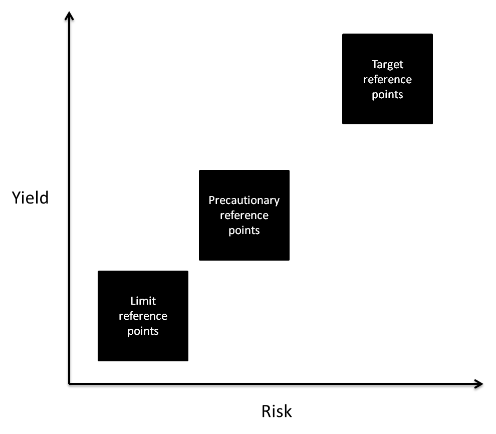
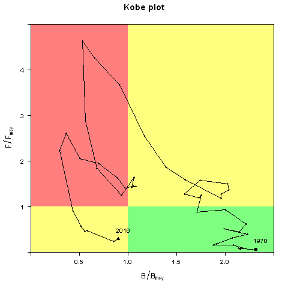
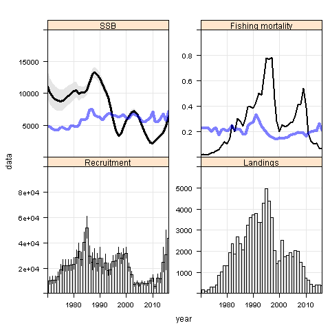
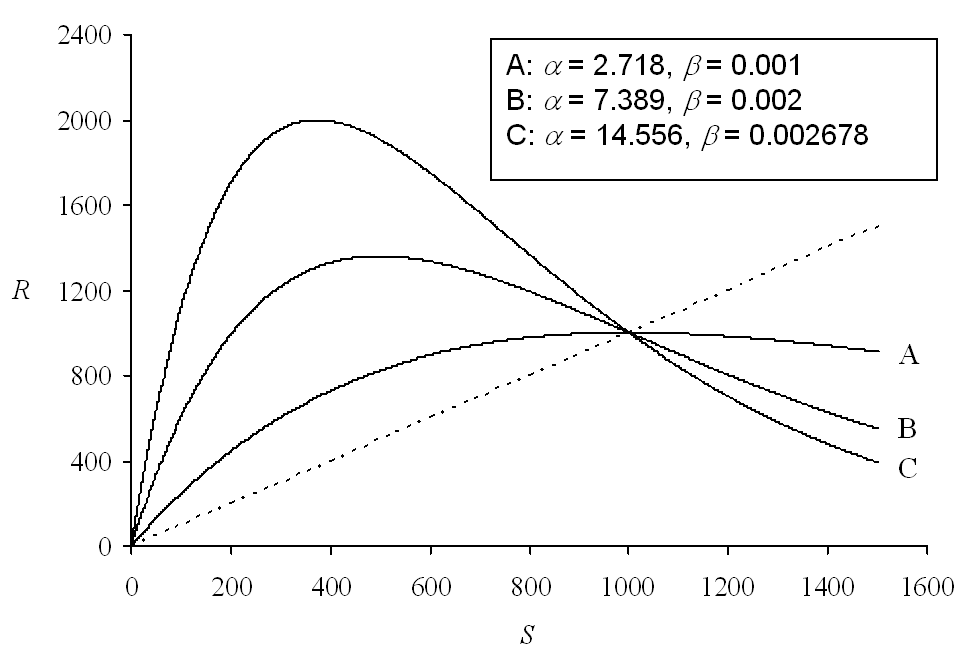
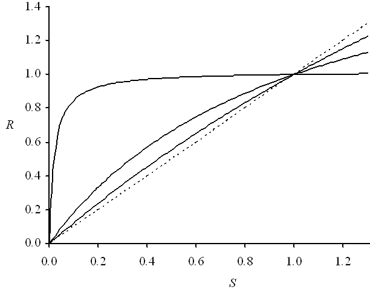
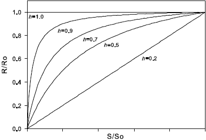
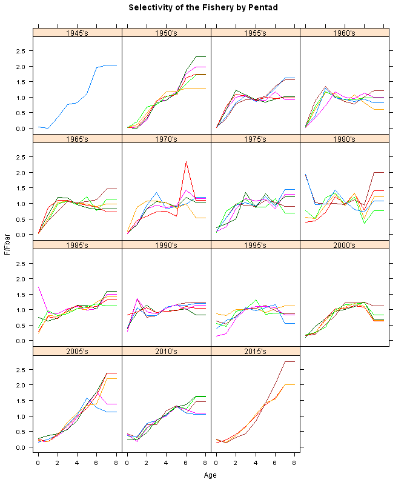
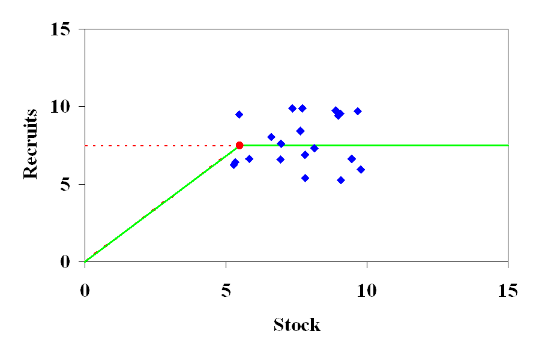

```{r, eval=TRUE, echo=FALSE}
knitr::opts_chunk$set(echo = FALSE)

library(knitr)

opts_chunk$set(comment=NA, 
               warning=FALSE, 
               message=FALSE, 
               error  =FALSE, 
               echo   =FALSE, 
               eval   =!TRUE,
               fig.width =4, 
               fig.height=4)

iFig=0
iTab=0
```


```{r init, eval=TRUE}
library(plyr)
library(ggplot2)
library(kobe)
library(reshape2)

dirMy="D:/Repository/DGMARETuna/tutorials/advice_framework"
#dirMy="/home/laurie/Desktop/flr/tutorials/advice_framework"
dirTex=file.path(dirMy,"tex")
dirDat=file.path(dirMy,"data")

load(file.path(dirDat,"yft.RData"))

```

### Stock Status and Reference points

To assess the status of a stock, reference points are needed. Is a stock overfished, or is overfishing going on. These aspects are considered in the light of stock status versus reference points.

In general, three types of reference points can be distinguished:
1. Target reference points, such as Fmsy and Bmsy and
2. Precautionary reference points, such as B~pa~ or B~threshold~, F~pa~ and 
3. Limit reference points, such as B~lim~, F~lim~ (IOTC), F~SPR~ or 20%~SSB0~ (ICCAT, SPRFMO)

All three reference point types are related, and in different parts of the world originated in a different way.

* **Target reference points** were designed to manage fish stock, with high probability, at long-term sustainable levels. 

* **Precautionary or threshold reference points** were designed to trigger some pre-agreed management action to reduce the risk to breach the limit (reference points).

* **Limit reference points** represent the level of biomass or fishing mortality that should be avoided as sustainability of the stock may be in danger

In terms of risk and yield, they are aligned as shown below. 



**Figure `r iFig=iFig+1; iFig`.** Relation between yield and risk of the three types of reference points.

The figure above should not be seen in isolation of stock status. If a fish stock declines, target reference points are no longer used as the management objective, but they are substituted for precautionary or limit reference points. When and where to swap from target to precautionary reference points is something Management Strategy Evaluation (MSE) can help with. The type of management action that needs to be taken when reaching precautionary or limit reference points is something that can be described in a Harvest Control Rule (HCR). The entire framework of target and limit reference points and different HCR scenarios can be evaluated inside an MSE framework. The MSE framework is then used to test the performance of the reference points and HCR in relation to the management objectives and includes the risk associated with not achieving the objectives. 

In the management context, only the target reference points are shown in the Kobe plot. These targets are put in relation to the estimated stock size and estimated fishing mortality. The way these reference points are calculated differs however per stock assessment approach, and the most common ones are explained below.  



**Figure `r iFig=iFig+1; iFig`.** Example of Kobe plot for a pelagic fish being sustainably fished (green area), overfished and overfishing going on (red area) and being either overfished (yellow left) and with overfishing (yellow right).

## Target reference points under biomass dynamic models

Under biomass dynamic models, target reference points are rather easily defined. There are two parameters crucial in calculating the reference points: $r$ and $K$. $r$ refers to the intrinsic growth rate of a population and $K$ refers to the carrying capacity of the population. Once both these are known (estimated) the MSy reference point can be calculated:

* $MSY = rK/4$
* $B~MSY~ = K/2$
* $F~MSY~ = r/2$

If we would take the example of Atlantic Albacore (following Polachek et al. 1993) where he estimated $r$ at 0.5 and $K$ at 200kt, we can estimate $MSY$ at 25kt, $B~MSY~$ at 100kt and $F~MSY~$ at 0.25 year^-1^.


**Figure `r iFig=iFig+1; iFig`** Production curve based on Biomass Dynamic Model

## Reference points under integrated (age-based) models

Target reference points can be estimated based on life-history characteristics such as growth, natural mortality, fecundity etc. The relationship between spawners and recruits (the stock recruitment relationship) is important here as well. Neither can we forget about the fleet dynamics (selection of fish ages). And most important, these processes are not stationary, they change every year.



**Figure `r iFig=iFig+1; iFig`.** Panels show the output of an intergated (catch-at-age) stock assessment model including SSB, fishing mortality, recruitment and the landings. The blue lines in the SSB and Fishing mortality panels show yearly updated estimated of B~MSY~ and F~MSY~ which clearly are not stationary. 

### Stock recruitment models 

Two different stock recruitment models are very often used by fisheries biologists:

1. A curve presented by Ricker $R=\alpha SSB^{-\beta SSB}$
2. A curve presented by Beverton & Holt $R=SSB/(\alpha SSB + \beta)$



**Figure `r iFig=iFig+1; iFig`.** Relationship between Recruitment (R) and Spawning Stock Biomass (S or SSB) as suggested by Ricker.



**Figure `r iFig=iFig+1; iFig`.** Relationship between Recruitment (R) and Spawning Stock Biomass (S or SSB) as suggested by Beverton & Holt.

The big difference between the first two stock-recruit curves is the difference in what happens to recruitment if stock sizes increase to large values. Ricker assumed that some sort of density dependence would occur, implying that fish compete for food at high densities and can allocate less resources to producing offspring. Or, if large quantities are offspring are produces, that these larvae compete for food and thereby limit the chance of all of them to recruit to the fishery. Assuming either a Ricker recruitment curve or a Beverton & Holt recruitment curve has substantial implications. In general, F~MSY~ and B~MSY~ are quite a bit larger when assuming Beverton & Holt than when assuming Ricker curves. 

Also the curvature near the origin matters to define target reference points. If e.g. a population can be fished to low biomass levels without increasing the risk to a collapse, and maintaining the potential to rapidly rebuild, we're talking about a fish stock with high resilience. The concept of resilience is capture in a parameter often referred to as **steepness**. If steepness is high, then a fish stock can be sustained at a low biomass without inflating risk to a collapse, if steepness is low, the risk to a collapse increases already at moderatly high biomasses and management actions need to come into play much earlier. 



**Figure `r iFig=iFig+1; iFig`.** Different steepness curves to illustrate the recruitment response of the stock at low biomass.

### Selection of the fishery

One other major point in estimating reference points is the selection of the fishery. If they select smaller/younger individuals, this affects MSY, and the change in the selection pattern affects therefore MSY over time. With the landing obligation coming into force, it may be expected in European waters the selection pattern of the fisheries change as well! 



**Figure `r iFig=iFig+1; iFig`.** Different estimated selection patterns of a fishery on a small pelagic fish over the years.

### Calculating F~MSY~, B~MSY~ and MSY

For a simple illustration, we only need a couple of equations:
$Catch = F / (F+M) \times  N  \times W \times (1-e^{(-F-M)})$  where $F$ is the fishing mortality (at age), $N$ is the numbers (at age) and $W$ is the weight (at age). We also need something to inform us about how fish are removed from the population (owing to natural or fisheries activities), this is the surivor equation: $N_{t+1} = N_{t} \times e^{(-F-M)}$ where $N_{t+1}$ indicates the population one year later. Finally, we need an assumption on the stock-recruitment curve and calculate SSB: $SSB = N \times W \times e^{(-F-M)} \times Mat$ where $Mat$ refers to the proportion maturity (at age) of the individuals.


| Age	|	N	  |	Sel |	W	    |	M	  |	Mat |	
|-----|-----|-----|-------|-----|-----|
| 1   |	100	|	0	  |	0.05	|	1	  |	0   |	
| 2	  |	37	|	0.1	|	0.15	|	0.7	|	0.3 |	
| 3	  |	17	|	0.2	|	0.22	|	0.4	|	0.7 |	 
| 4	  |	9	  |	0.4	|	0.25	|	0.3	|	1   |	
| 5	  |	5	  |	0.6	|	0.27	|	0.2	|	1   |	
| 6	  |	2	  |	0.4	|	0.28	|	0.1 |	1   |	

If we do the math here, and try to convert the selection pattern to a fishing mortality (we can simply assume that the selection pattern $=$ the fishing mortality), we would obtain a total catch of 10kg of fish, at an average F of 0.28 and a biomass of 18kg. If we would increase the fishing mortality by a factor two, the catch drops to 8kg of fish, at an average F of 0.57 and a biomass of 16kg. If we were to cut fishing mortality in half, catch would increase to 12kg, biomass to 20kg and F would end up at 0.14. 
From this example, you can already see how the optimum F and MSY can be calculated. *Note however that we have not used a stock-recruitment curve in a dynamic way which would provide feedback on the amount of recruits that join the population (now set to 100 each year)*. 

### Calculating limit reference points

A common approach in estimating limit biomass reference points is to find the point at which the Spawning Stock Biomass cannot produce sufficient recruits to sustain the population. This means that below that limit biomass reference point, less recruits per spawner are produced (reduced fertilization, finding mates becomes more difficult). One way to estimate this 'inflection' point is to fit a Hockey-stick stock-recruit curve through the SSB - R observations. This breakpoint is then often taken as the limit reference point. The fishing mortality needed to fish the stock down to this SSB level is then assumed to represent the F~lim~.



**Figure `r iFig=iFig+1; iFig`.** Hockey stick relationship between Recruitment (R) and Spawning Stock Biomass (S or SSB) 

Often, as limit reference points, certain percentages of the estimated unexploited biomass (B~pristine~ or B~0~) are used, e.g. B~40%~. B~pristine~ is calculated assuming no fishery to take place. Since we know, from the stock assessment model, what the stock numbers (at age) are, their weight and natural mortality, we can calculate B~pristine~. Afterwards, this number can be compared to the actual biomass estimated to see if it is above or below B~40%~. 

Limit reference points can also be determined through simulation (MSE), including a more elaborate risk assessment where population dynamics are evaluated over time with different scenarios of fisheries and management. The point at which risk to stock collapse becomes too large for management can be derived from such simulations. 


### Calculating precautionary reference points

The role of precautionary reference points is one to provide a buffer in case of uncertainty in the stock assessment, implementation, etc. This uncertainty is always present and the magnitude of the uncertainty determines where precautionary reference points should be positioned. The simplest (but not robust) approach is to multiply the limit reference points with a factor > 1. Better is to use Management Strategy Evaluation to determine robust precautionary reference points. 

# Exercise

```{r, eval=FALSE, echo=FALSE}
library(shiny)
runApp("./shinyRefpoints/")
```

