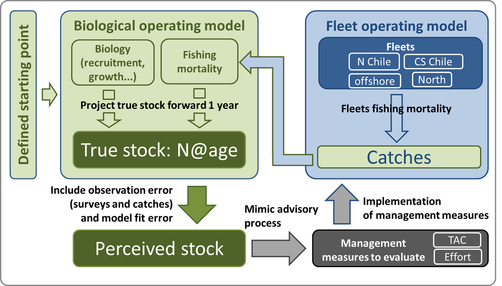
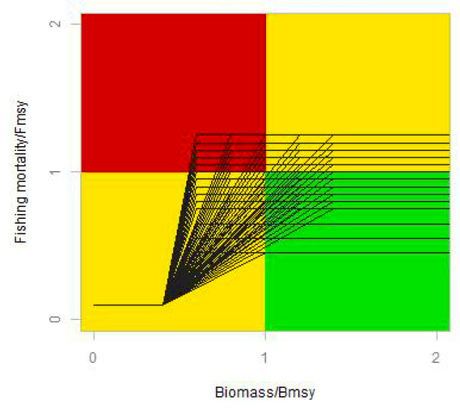
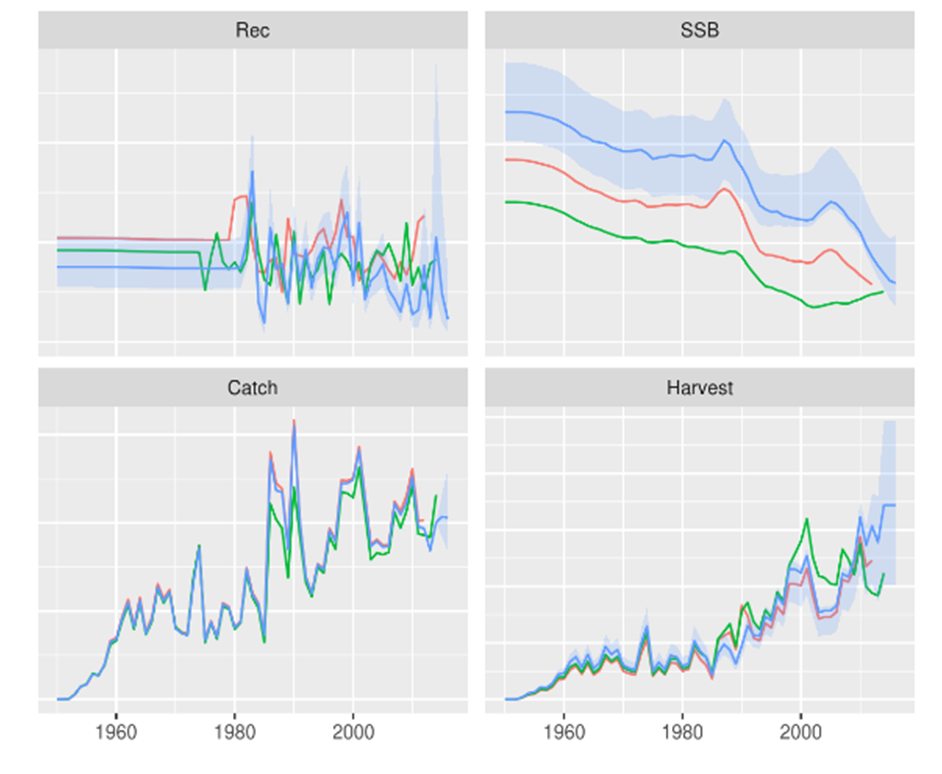
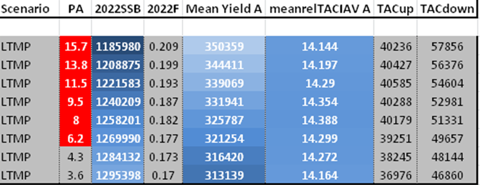

# Management Plans

A Management plan is a set of pre-defined and agreed rules on how to manage a fish stock. Stock status may vary over time and a different stock status may require a different management approach. All aspects of what has been discussed so far, relating to data, assessment, reference points and harvest control rules come together in a management plan. 

Often, the core of a management plan is the Harvest Control rule (HCR). The HCR stipulates the target fishing mortality to base TAC calculations on. It embeds target, threshold and limit reference points in its design. 
Often before a management plan is adopted, it is thoroughly tested to deliver according to the agreed performance indicators, such as yield and stability. 

```{r, eval=TRUE, echo=FALSE}
knitr::opts_chunk$set(echo = FALSE)

library(knitr)

opts_chunk$set(comment=NA, 
               warning=FALSE, 
               message=FALSE, 
               error  =FALSE, 
               echo   =FALSE, 
               eval   =!TRUE,
               fig.width =4, 
               fig.height=4)

iFig=0
iTab=0
```


```{r, eval=TRUE, echo=FALSE}

SSB <- seq(0,100,1)
Fs  <- c(seq(0,0.2,length.out=41),rep(0.2,length.out=60))

plot(x=SSB,y=Fs,xlab="Spawning stock biomass",ylab="Fishing mortality",las=1,xlim=c(0,100),ylim=c(0,0.4),type="l",lwd=2)
abline(h=0.2,col=2,lty=2)
abline(v=40,col=3,lty=3)
```

**Figure `r iFig=iFig+1; iFig`.** Generic Harvest Control Rule

Testing the robustness and afficacy of a management plan can be executed using Management Strategy Evaluation.
Execution of an MSE can be summerized in the folowing steps:

1. Identification of **management objectives** and mapping these into **statistical indicators of performance** or utility functions
2. Selection of hypotheses for considering in the **Operating Model** that represents the simulation version of reality
3. **Conditioning** of the Operating Model based on data and knowledge, and weighting of model hypotheses depending on their plausibility
4. Identifying candidate management strategies and coding these as **Management Plans**
5. **Projecting** the Operating Model forward in time using the Management Plans as a feedback control in order to simulate the long-term impact of management
6. Identifying the Management Plan that robustly meet **management objectives**

## Identifying management objectives and indicators of performance

In general, there are four types of performance indicators:

1. Status of the stock / fishery
2. Safety / risk
3. Yield
4. Stability

### Status of the stock / fishery
The status of the stock can be evaluated in relation to reference points such as B~MSY~ or F~MSY~ (see also the Kobe framework). Indicators could be defined as: 

* Probability of being in the Kobe green quadrant
* Probability of being in the Kobe red quadrant

### Safety

Safety is related to the risk of stock collapse / reduced recruitment
Performance indicators in this area focus often on:

* Probability to be below B~lim~ or B~MSY~
* Probability to be above B~lim~ but below B~THRESHOLD~

### Yield

Yield (either catch, or economic / social considerations) can be considered in terms of Short/medium/long term expected catch

### Stability

Stability finally is a performance indicator often required by the fishing fleet and processing industry. Performance indicators in this area focus on

* Change in catch from year to year
* Probability of a fishery closure
* Minimum TAC over a certain time range

## Operating model

Next in line is selecting the operating model. First however, we illustrate how all further elements on the list link together.



**Figure `r iFig=iFig+1; iFig`.** Generic outline of an MSE

The operating model refers to the biological operating model. It is a way of simulating the 'true' dynamics of a fish population. This can either be based on simple biomass dynamics or more complex age-based dynamics (as is done in IATTC for bigeye tuna or Jack mackerel in the SPRFMO), or one could choose to simulate the true dynamics on known ecological processes such as growth, food limitation, reproductive capacity. In this part of MSE may contain a very wide range of **hypotheses** on how the population dynamics work and how a population is expected to vary over time. It is also the place where different hypotheses on e.g. stock structure or movement rate can be simulated. Stock structure for example is very difficult to measure, MSE can help however to investigate if making the wrong assumption on stock structure is dangerous in terms of fisheries management.

## Conditioning

Once different hypotheses are formulated on stock dynamics, these models need to be parameterised using the best available data and knowledge. Assumptions on recruitment, energy allocation to growth, maturation, etc need to be parameterised. Other important processes such as food limitation, movement, response to changing environmental conditions, interactions with other prey and predators and habitat use are also required to be defined in terms of dynamics and the parameters belonging to these processes. 

After the Operating model and conditioning steps, the dynamics of the fish stock can be simulated, including making predictions for the future. 
In this step, two other building blocks need to be addressed: generating 'observations' from the **'true' dynamics**, similar to what we do in surveys or in generating CPUE indices. Here, observation uncertainty or bias comes in which can be mimicked (also known as the **Observation Error Model**, OEM). Also, historic catches are reconstructed from the 'true' dynamics which may be fed into a stock assessment (or a simplification of the assessment model) to generate a **'perceived stock'**. The 'perceived stock' in an MSE is no different from the concept of the real stock assessment in reality. It is our understanding of the stock status and dynamics assuming that the data that went into the assessment are representative for the stock. The main difference to reality is that in an MSE we also know the dynamics of the 'true' population while in reality we don't. At the same time, the **dynamics of the fishing fleet** need to be simulated: how much will they catch, what areas will the fish in, how much effort will be spend, what type of gear selectivity will be used etc. In the MSe, the fleet generates fishing mortality that affects on its turn the 'true' population. The perceived stock will be used to test **management plan** designs. Finally, the implementation of management targets such as quota may not be followed 1:1. E.g. there may be an overshoot of the TAC on a yearly basis. The discrepency between management targets and implementation is known as **'implementation error'**, another topic that can be simulated in MSE. 

## Management plan design

Next in line is proposing different management plan designs. These can vary in the way the set target, threshold and limit reference points. The 'generic' harvest control rule as illustrated at the top is copied in the Kobe framework below in different variaties. 



**Figure `r iFig=iFig+1; iFig`.** Proposing different management plan designs.

## Management objectives

The last element in line is evaluating how well certain management plan designs functioned in terms of the proposed indicators. To do this, one must go through a sequence of steps:

1. Setup the operating models and parameterize it
2. Simulate the fish population over time, being fished by the fishing fleet
3. Use stock assessment models (or deviates of that) to generate a perception of the stock
4. Predict TACs using an assumed Harvest Controle rule under the perception of the stock
5. Set TACs that can be caught by the fishing fleet that, in its turn, generate fishing mortality and hereby affect the survival of fish in the Operating Model
6. Project the 'true' population one year further in time and start at number 2 again. 
7. Do this for all combinations of operating models and harvest control rules defined.
8. Compare the 'true' population dynamics and fishery results in relation to performance indicators



**Figure `r iFig=iFig+1; iFig`.** Results of Indian Ocean Albacore MSE



**Figure `r iFig=iFig+1; iFig`.** Indicator results of MSE of NEA small pelagic stock


### **Exercise:**                                             
http://rscloud.iccat.int:3838/swo-med/


# References
