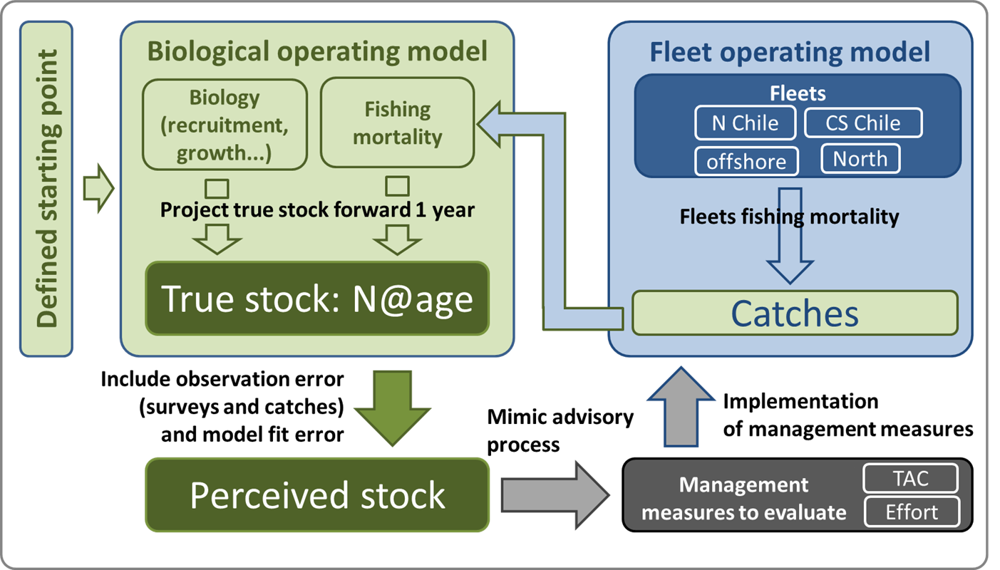
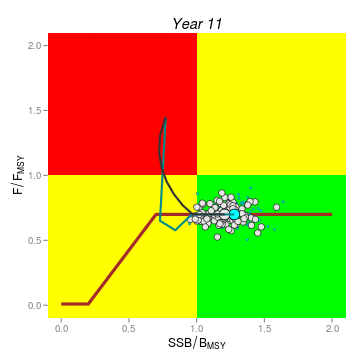
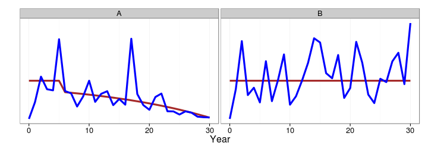
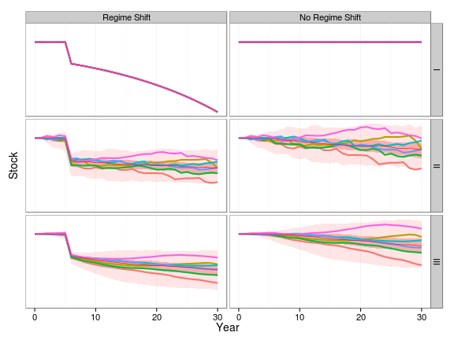
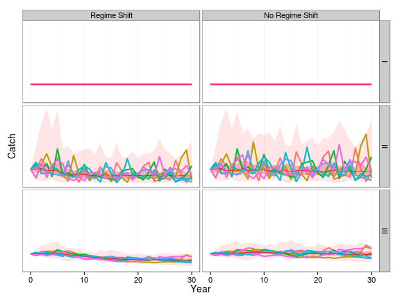

## The Precautionary Approach

When managing fisheries decisions have to be made with incomplete knowledge. Therefore undesirable outcomes should be be anticipated; measures taken to reduce the risk of them occurring; corrective measures should be applied immediately and be effective within an acceptable time frame.

This requires limit and threshold reference points, used as part of a Harvest Control Rule. Consideration must be given to major uncertainties. e.g. in status of the stocks relative to reference points, biology, environmental events and the ability to implement management measures.

Harvest Control Rules will not necessarily be precautionary if they are not formally evaluated to determine how well they actually achieve their goals given uncertainty. Therefore often simulation is used to evaluate the impact of the main sources of uncertainty on the robustness of alternative HCRs and Management Strategies

## Management Procedures

Management Strategy Evaluation (MSE) is the use of simulation to evaluate the impact of uncertainty and reducing the risk, where risk is an uncertainty that matters. MSE allows a fuller consideration of uncertainty as required by the Precautionary Approach; provides stability if management objectives and how to evaluate how well alternative management strategies meet them are agreed through a dialogue between scientists and stakeholders; and can be used to guide the scientific process by identifying where the reduction of scientific uncertainty will improve management and so help to ensure that expenditure is prioritised to provide  the best research, monitoring and enforcement. 

MSE is also synonymous with the Management Proceedure (MP) approach, and is used to describe the process of testing generic MPs or harvest strategies. Under the MP approach a resource is managed using a fully specified set of rules incorporating feedback control; the approach is explicitly precautionary through its requirement for simulation trials to have demonstrated robust performance across a range of uncertainties about resource status and dynamics. MSE can also be used to identify the Value of Infomation (VoI) and the Value of Control (VoC), by simulation testing the elements of a management strategy given uncertainty, e.g. about the resource dynamics and our ability to implement management measures.

A management strategy is usually synonymous with MP but some authors use it to mean an a Harvest Control Rule (HCR) which is a set of well-defined rules used for determining management action in the form of a total allowable catch (TAC) or allowable fishing effort given input from an estimator or directly from data.
```{r, eval=TRUE, echo=FALSE}
knitr::opts_chunk$set(echo = FALSE)

library(knitr)

opts_chunk$set(comment=NA, 
               warning=FALSE, 
               message=FALSE, 
               error  =FALSE, 
               echo   =FALSE, 
               eval   =!TRUE,
               fig.width =4, 
               fig.height=4)

iFig=0
iTab=0
```


```{r, eval=TRUE, echo=FALSE}

SSB <- seq(0,100,1)
Fs  <- c(seq(0,0.2,length.out=41),rep(0.2,length.out=60))

plot(x=SSB,y=Fs,xlab="Spawning stock biomass",ylab="Fishing mortality",las=1,xlim=c(0,100),ylim=c(0,0.4),type="l",lwd=2)
abline(h=0.2,col=2,lty=2)
abline(v=40,col=3,lty=3)
```

**Figure `r iFig=iFig+1; iFig`.** Generic Harvest Control Rule

Testing the robustness and afficacy of a management plan can be executed using Management Strategy Evaluation.
Execution of an MSE can be summerized in the folowing steps:

1. **Identification of management objectives** and mapping these into **statistical indicators of performance** or utility functions
2. **Selection** of hypotheses for considering in the **Operating Model** that represents the simulation version of reality
3. **Conditioning** of the Operating Model based on data and knowledge, and weighting of model hypotheses depending on their plausibility
4. **Identifying** candidate management strategies and coding these as **Management Plans**
5. **Projecting** the Operating Model forward in time using the Management Plans as a feedback control in order to simulate the long-term impact of management
6. Identifying the Management Plan that robustly meet **management objectives**

## Identifying management objectives and indicators of performance

In general, there are four types of performance indicators:

1. Status of the stock / fishery
2. Safety / risk
3. Yield
4. Stability

### Status of the stock / fishery
The status of the stock can be evaluated in relation to reference points such as B~MSY~ or F~MSY~ (see also the Kobe framework). Indicators could be defined as: 

* Probability of being in the Kobe green quadrant
* Probability of being in the Kobe red quadrant

### Safety

Safety is related to the risk of stock collapse / reduced recruitment
Performance indicators in this area focus often on:

* Probability to be below B~lim~ or B~MSY~
* Probability to be above B~lim~ but below B~THRESHOLD~

### Yield

Yield (either catch, or economic / social considerations) can be considered in terms of Short/medium/long term expected catch

### Stability

Stability finally is a performance indicator often required by the fishing fleet and processing industry. Performance indicators in this area focus on

* Change in catch from year to year
* Probability of a fishery closure
* Minimum TAC over a certain time range

## Operating model

Next in line is selecting the operating model. First however, we illustrate how all further elements on the list link together.



**Figure `r iFig=iFig+1; iFig`.** Generic outline of an MSE

The operating model refers to the biological operating model. It is a way of simulating the 'true' dynamics of a fish population. This can either be based on simple biomass dynamics or more complex age-based dynamics (as is done in IATTC for bigeye tuna or Jack mackerel in the SPRFMO), or one could choose to simulate the true dynamics on known ecological processes such as growth, food limitation, reproductive capacity. In this part of MSE may contain a very wide range of **hypotheses** on how the population dynamics work and how a population is expected to vary over time. It is also the place where different hypotheses on e.g. stock structure or movement rate can be simulated. Stock structure for example is very difficult to measure, MSE can help however to investigate if making the wrong assumption on stock structure is dangerous in terms of fisheries management.

## Conditioning

Once different hypotheses are formulated on stock dynamics, these models need to be parameterised using the best available data and knowledge. Assumptions on recruitment, energy allocation to growth, maturation, etc need to be parameterised. Other important processes such as food limitation, movement, response to changing environmental conditions, interactions with other prey and predators and habitat use are also required to be defined in terms of dynamics and the parameters belonging to these processes. 

In the tRFMOs mainly done using stock assessment models. Modern stock assessment models have grown increasingly complex, however, and their development is limited to a priesthood of experts. In contrast Hilborn (2003) stated that he believed the future trend will be to base management decisions on simple rules that are more often data-based rather than model-based, while the complex models will serve primarily to evaluate the robustness of these decision rules.

The choice of hypotheses and how to weight them is critical, since once the OMs are chosen the "best" management procedure is determined, the task is to find it. There are many alternative ways to condition an OM. One approach is to use an Integrated stock assessment model like SS or Multifan-CL. 

The use of an assessment model as the OM implies that they can describe nature almost perfectly. If an assessment model can describe nature why bother with MSE? However, if a management procedure can not perform well when reality is as simple as implied by an assessment model it is unlikely to perform adequately for more realistic representations of uncertainty about resource dynamics. Basing an OM on the current assessment model also has arguably the lowest demands for knowledge and data and allows RFMOs to make a phased transition from the stock assessment paradigm to a risk based approach.

There are many important processes, however, that are not modelled in stock assessments and affect the robustness of control systems. Therefore to ensure a control system is robust also requires OMs to be conditioned based on expert beliefs and other a priori information about the processes that may affect the behaviour of management systems in the future. I.e. the focus is on the future, not on fitting historical data as when conditioning an OM on a stock assessment. This is a less data, and more hypothesis-orientated approach.

Not only the OM needs to be parametersized, but also our way we observe the stock and the fishery that generates catches. Hence, in this step, two other building blocks need to be addressed: generating 'observations' from the **'true' dynamics**, similar to what we do in surveys or in generating CPUE indices. Here, observation uncertainty or bias comes in which can be mimicked (also known as the **Observation Error Model**, OEM). Also, historic catches are reconstructed from the 'true' dynamics which may be fed into a stock assessment (or a simplification of the assessment model) to generate a **'perceived stock'**. The 'perceived stock' in an MSE is no different from the concept of the real stock assessment in reality. It is our understanding of the stock status and dynamics assuming that the data that went into the assessment are representative for the stock. The main difference to reality is that in an MSE we also know the dynamics of the 'true' population while in reality we don't. At the same time, the **dynamics of the fishing fleet** need to be simulated: how much will they catch, what areas will the fish in, how much effort will be spend, what type of gear selectivity will be used etc. In the MSe, the fleet generates fishing mortality that affects on its turn the 'true' population. The perceived stock will be used to test **management plan** designs. Finally, the implementation of management targets such as quota may not be followed 1:1. E.g. there may be an overshoot of the TAC on a yearly basis. The discrepency between management targets and implementation is known as **'implementation error'**, another topic that can be simulated in MSE. 

## Management Objectives

The tuna Regional Fisheries Management Organisations (tRFMOs) use a common management framework based on target reference points, for example ICCATs Principles of Decision Making  are based on the framework

If a stock is in the Red Quadrant of the Kobe Phase Plot, i.e. it is overfished and overfishing is occurring then 


Then

+ management should ensure a high probability of ending overfishing in as short a time period as possible; and 
+ a plan must be adopted for rebuilding taking into account stock biology and SCRS advice

To do this requires the definition of

+ Risk Levels, Probabilities and Time Scales?
+ Short-term objective to stop overfishing,
+ Long-term objective to recover stock to a level that can support MSY


### Stop Overfishing


#### Trade-offs between objectives

Objectives

+ Short-term to stop overfishing,
+ Long-term objective to recover stock to a level that can support MSY

Trade-offs

+ Short a time as possible?
+ Acceptable timeframe?


#### Trade-offs between objectives

How Do The Recoveries Compare?

+ Takes 7 years for F to be reduced to target
+ Yield is higher initially but is less in the medium term
+ Stock recovery takes twice as long, 6 as opposed to 3 years


#### Maintain healthy stocks

Management measures shall be designed to result in a high probability of maintaining the stock within the green quadrant



### Take home message

+ Constant catch strategies are not robust
+ Catch is more variable under Strategy \textbf{II}
+ Risk of not being in the Green Quadrant?
+ Trade-offs between objectives?
+ Risk of stock assessment getting dynamics wrong and Regime Shifts, ...
+ How to prioritise funding to get appropriate research, monitoring and enforcement levels?

# Examples

## Regime shift

Is it A or B?


It was A.


It took 20 years to work out that the stock had experienced a decline unrelated to fishing, however, we can not wait 20 years.

What to do? run an MSE and simulate two hypotheses, i.e.

+ No Change  or 
+ Change in Productivity

Thene valuate alternative management strategies i.e.

+ Constant Catch
+ 5\% of Assessed Stock Biomass
+ 80\% of Last Years Catch + 20\% of Catch under II

### Which Strategy is the most robust?

There are three main types of performance indicators, related to

+ Safety
+ Yield
+ Stability


Main objective is what happened to the stock?


Second objective what happened to yield?


Variability is more important than the expected.





**Figure `r iFig=iFig+1; iFig`.** Indicator results of MSE of NEA small pelagic stock


### **Exercise:**                                             
http://rscloud.iccat.int:3838/swo-med/


# References
