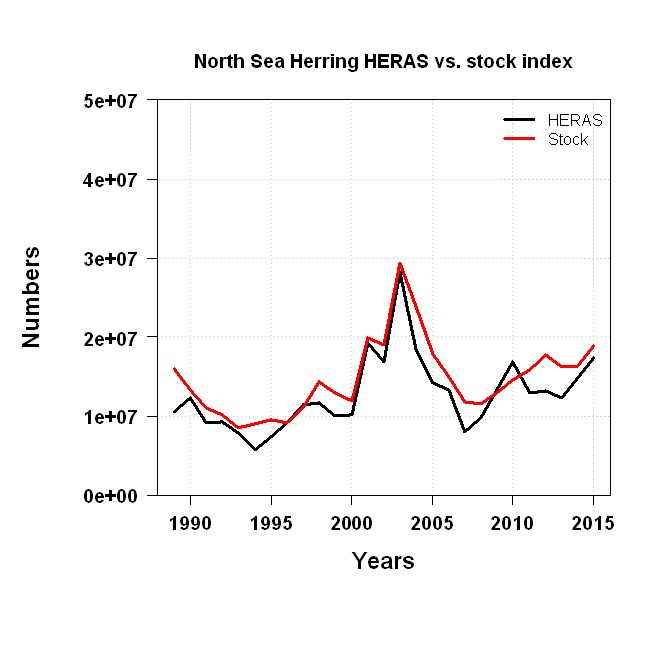

# Outline
This course is an introduction for DG MARE desk Officers and other officials to the current state of the art in Quantitative Fisheries Science (QFS), as applied at different RFMO scientific bodies, with special emphasis on the solutions used by the various tuna RFMOs.

Topics covered are current practice in stock assessment, provision of quantitative advice and evaluation through simulation of alternative management plans, will be presented using recent examples.

```{r, eval=TRUE, echo=FALSE}
knitr::opts_chunk$set(echo = FALSE)

library(knitr)

opts_chunk$set(comment=NA, 
               warning=FALSE, 
               message=FALSE, 
               error  =FALSE, 
               echo   =FALSE, 
               eval   =!TRUE,
               fig.width =4, 
               fig.height=4)

iFig=0
iTab=0
```

```{r init, eval=TRUE}
library(plyr)
library(ggplot2)
library(kobe)
library(reshape2)

dirMy="D:/Repository/DGMARETuna/tutorials/advice_framework"
dirMy="/home/laurie/Desktop/flr/tutorials/advice_framework"
dirTex=file.path(dirMy,"tex")
dirDat=file.path(dirMy,"data")

load(file.path(dirDat,"yft.RData"))

trk =transform(subset(yft,year%in%1970:2014),stock=stock,harvest=harvest)[,
                  c("year","Scenario","Method","stock","harvest")]
trk2=ddply(melt(trk,id=c("Scenario","Method","year")),.(variable,year,Method,Scenario),with, 
               median(value))
msy  =ddply(yft,.(Method,Scenario), with, c("bmsy"=bmsy[!is.na(bmsy)][1],"fmsy"=fmsy[!is.na(fmsy)][1]))

quads=rbind(data.frame(x=c(-Inf,-Inf,Inf,Inf), y=c(-Inf,  1,  1,-Inf), 
                         fill=as.factor("high")),
            data.frame(x=c(-Inf,-Inf,Inf,Inf), y=c(   1,Inf,Inf,   1), 
                         fill=as.factor("low")))
quad2=rbind(cbind(variable="stock",ddply(msy,.(Method,Scenario), 
                        transform, y=quads$y*bmsy,x=quads$x,fill=quads$fill)),
            cbind(variable="harvest",ddply(msy,.(Method,Scenario), 
                        transform, y=quads$y*fmsy,x=quads$x,fill=quads$fill)))[,-(4:5)]

quad2=transform(quad2,variable=ifelse(variable=="harvest","F/F[MSY]","B/B[MSY]"))

hcr= data.frame(stock  =c(0.0 ,0.1 , 0.6,7.5), 
                harvest=c(0.01,0.01, 0.7,0.7))
```


# Agenda: Day 1

| Day 1         |                                                           |
| --------------|:----------------------------------------------------------|
| 09:30 – 10:15 | **Presentation:** Advice frameworks                       |
| 10:15 – 10:45 | **Presentation:** Assessment: knowledge and data          |
| 10:45 – 11:00 | **Tea Break:**                                            |
| 11:00 – 12:15 | **Exercise:**                                             |
| 12:15 – 13:15 | **Lunch:**                                                |
| 13:15 – 14:30 | **Presentation:** Assessment: model assumptions           |
| 14:30 – 15:15 | **Exercise:**                                             |
| 15:15 – 15:30 | **Tea Break:**                                            |
| 15:30 – 16:30 | **Presentation:** Stock Status and Reference points       |
| 16:30 – 17:00 | **Summary of the day:**                                   |

# Advice Frameworks (LAURIE)

The provision of fisheries management advice requires the assessment of stock status relative to reference points, the prediction of the response of a stock to management, and checking that predictions are consistent with reality.

## The Kobe Advice Framework               

The Tuna Regional Fisheries Management Organisations (tRFMOs) use a common framework to provide advice known as the **Kobe Framework**. The first step in developing an advice framework is to agree the management objectives. The original objective of the tuna Regional Fisheries Management Organisations (tRFMOs) was to keep stocks at a level that will support MSY. Under the precautionary approach, however, it is no longer sufficient to just know where we are, we also need to consider the impact of uncertainty on our ability to achieve management objectives. That is to assess risk, where risk is an uncertainty that matters and what matters are management objectives. There are two main ways to reduce risk in fisheries management, i.e. reduce uncertainty by obtaining better infomation or implementing better management.

The main management objectives are related to yield, safety and stability. The trade-offs between ojectives are also important and that any indicators used in an advice framework should not overlap in what they tell us. Therefore to help implement the Precautionary Approach the tRFMOs are begining to simulation Harvest Control Rules (HCRs) with respect to their ability to meet multiple conflicting objectives using Management Strategy Evaluation (MSE). 

### Atlantic Yellowfin               

How often advice is updated depends upon the dynamics of a stock and the management framework. For long lived species such as tuna where management regulations are agreed for a number of years, stock assessments are not conducted each year for every stock. For example Atlantic yellowfin was reassessed in 2016 following the last assessment in 2011. 

Not only the data but the stock assessment models and scenarios changed between assessments. In 2011 Virtual Population Analysis (VPA) and biomass dynamic models; while in 2016 year an age Structured Production Model (ASPM) and an Integrated Statistical Model (Stock Synthesis) were used as well. The four models span a range of complexity and have different data requirements, e.g. catch, effort, catch-at-size, catch-at-age or CPUE. Also many parameters can not be estimated from the data alone and must be fixed or based on meta-analysis. 

#### Historical Stock Status

The following examples, based on the 2016 Atlantic yellowfin stock assessment, illustrate the Kobe Advice Framework and the impact of uncertainty in parameter estimation, model structure and data.

#### A single assessment model and 1 set of CPUE indices

```{r, fig.width=6,fig.height=3, eval=TRUE}
names(msy)[3:4]=c("stock","harvest")
trk.rel=merge(trk2,melt(msy,id=c("Method","Scenario")),
          by=c("Method","Scenario","variable"))
trk.rel=transform(trk.rel,value=value*V1,
                  variable=ifelse(variable=="harvest","F/F[MSY]","B/B[MSY]"))[,-5]

ggplot(subset(trk.rel,Method=="SS"&Scenario==1))+
  geom_line(aes(year,value),col="brown",size=1.5)+
  facet_grid(variable~.,scale="free_y", labeller = label_parsed)+
  theme_bw(12)+theme(legend.position="none")+
  ylab("")+xlab("Year")
```

**Figure `r iFig=iFig+1; iFig`.** Absolute estimates

```{r, fig.width=6,fig.height=3, eval=TRUE}
ggplot(subset(trk.rel,Method=="SS"&Scenario==1))+
  geom_polygon(aes(x,y,fill=fill),data=subset(quad2,Method=="SS"&Scenario==1)) +
  geom_line(aes(year,value),col="brown",size=1.5)+
  facet_grid(variable~.,scale="free_y")+
  scale_fill_manual(values=c("pink","lightgreen"), guide="none") +  
  facet_grid(variable~.,scale="free_y", labeller = label_parsed)+
  theme_bw(12)+theme(legend.position="none")+
  ylab("")+xlab("Year")
```

**Figure `r iFig=iFig+1; iFig`.** Estimates relative to reference points


#### Structual and data uncertainty

```{r, fig.height=3,fig.width=7, eval=TRUE}
ggplot(trk.rel)+
  geom_polygon(aes(x,y,fill=fill),data=quad2) +
  geom_line(aes(year,value,col=factor(Scenario)))+
  facet_grid(variable~Method,scale="free_y", labeller=label_parsed)+
  scale_fill_manual(values=c("pink","lightgreen"), guide="none") +  
  theme_bw()+theme(legend.position="none")+
  ylab(expression(""))+
  xlab("Year")
```

**Figure `r iFig=iFig+1; iFig`.** Estimates relative to reference points

(the figure below is becoming too much for the introduction, my suggestion is to stop here probably. To keep the code clean, let's delete it even if it's not printed to PDF)
<span style="color:red">I disagree, we need to show how advice is formulated, the requirements, the uncertainty and risks.</span>

#### Status relative to reference points

```{r, eval=TRUE}
dat=ddply(subset(trk,Method=="SS"&Scenario==1&year<=2014),.(year),
          with, data.frame(stock=median(stock),harvest=median(harvest)))

p=kobePhase(dat)+
  geom_path( aes(stock,harvest),col="brown",size=.75)+
  geom_point(aes(stock,harvest),shape=21,fill="red",col="brown",size=1.5,
             data=subset(dat,year%in%seq(1950,2014,5)))+
    geom_point(aes(stock,harvest),shape=21,fill="red",col="brown",size=2.5,
             data=subset(dat,year==2014))
p
```

<!-- **Figure `r iFig=iFig+1; iFig`.** Phase plot -->

#### Estimates of uncertainty from a stock assessment 

```{r, eval=TRUE}
p+
  geom_point(aes(stock,harvest),shape=21,fill="red",col="brown",size=2.5,
             data=subset(yft,Method=="SS"&Scenario==1&year%in%2014))
```

**Figure `r iFig=iFig+1; iFig`.** Uncertainty in current estimates

##### Estimates of uncertainty across stock assessments 

```{r, eval=TRUE}
dat=ddply(subset(trk,year<=2014),.(Method,Scenario,year),
          with, data.frame(stock=median(stock),harvest=median(harvest)))

kobePhase(dat)+
  geom_path( aes(stock,harvest),col="brown",size=.75)+
  geom_point(aes(stock,harvest),shape=21,fill="red",col="brown",size=1.0)+
  facet_grid(Method~Scenario)
```


**Figure `r iFig=iFig+1; iFig`.** Phase plot


```{r, eval=TRUE}
kobePhase(subset(yft,year%in%2014))+
  geom_point(aes(stock,harvest),shape=21,fill="red",col="brown")+
  facet_grid(Method~Scenario)
```

**Figure `r iFig=iFig+1; iFig`.** Phase plot

 
```{r, eval=TRUE}
kobe:::kobePhaseMar3(transform(subset(yft,year%in%2014),run=paste(Method,Scenario)
                               )[,c("stock","harvest","run")])
```

**Figure `r iFig=iFig+1; iFig`.** Phase plot 


```{r, eval=TRUE}
kobe:::kobePhaseMar2(transform(subset(yft,year%in%2014),run=paste(Method,Scenario)
                               )[,c("stock","harvest","run")])
```

**Figure `r iFig=iFig+1; iFig`.** Phase plot

### Management Predictions  

Prediction is often used synonymously citep{bray2009prediction} with forecast, projection and scenario. To avoid confusion we base our definitions on those of the International Panel on Climate Change  citep[IPCC]![]{field2012managing}. A projection is a potential future evolution of a quantity or set of quantities, a prediction or forecast is the result of an attempt to produce an estimate of the actual evolution of the future, while a scenario is a possible, plausible, internally consistent, but not necessarily probable, development.)

### Strategy matrix

**Figure `r iFig=iFig+1; iFig`.** Strategey matrix

### Decision table

**Figure `r iFig=iFig+1; iFig`.** Decision table

### Projections

**Figure `r iFig=iFig+1; iFig`.** Projections

### Harvest control rule

```{r}
kobePhase()+
  geom_line(aes(stock,harvest),data=hcr,col="orange",size=2)
```

```{r, eval=TRUE}
kobePhase(dat)+
  geom_point(aes(stock,harvest),shape=21,fill="red",col="brown",size=1.0)+
  geom_point(aes(stock,harvest),shape=21,fill="red",col="brown",size=1.0)+  
  geom_line(aes(stock,harvest),data=hcr,col="orange",size=2)
```

```{r}
kobePhase(dat)+
  geom_point(aes(stock,harvest),shape=21,fill="red",col="brown",size=1.0,)+
  geom_point(aes(stock,harvest),shape=21,fill="red",col="brown",size=1.0)+  
  geom_line(aes(stock,harvest),data=hcr,col="orange",size=1)+
  facet_grid(Method~Scenario)
```


## Stock Assessment
### Data and knowledge 
#### The Russell Equation

The provision of fisheries management advice requires the assessment of stock status relative to reference points, the prediction of the response of a stock to management, and checking that predictions are consistent with reality.

@russell1931theoretical summarised the key processes influencing the dynamics of exploited populations, 
i.e. 

\begin{equation}f(B_{t+1}) = B_{t} - (F+M) + (G+R) \end{equation}

where a biomass $B_{t+1}$ is a function of the biomass in the previous year ($B_t$), losses due to fishing (F) and natural mortality (M), and gains due to growth (G) and recruitment (R). Two processes have been recognised since Russel originally formulated his equation, important for highly migratory populations, i.e. gains due to immigration (I) and losses due to emigration (E) i.e.

\begin{equation}f(B_{t+1}) = B_{t} - (F+M+H)  + (G+R+I)\end{equation}

Knowledge about all these processes affects our ability to provide robust scientific advice. 

Fisheries management relies heavily on reference points, for limits and target, which can be estimated from complex statistical or simple models. An alternative approach is the use of management strategy evaluation (MSE) to tune HCRs to set management measures such as catch quotas, directly from the observed data. Most reference points, from both simple and complex models, are based on the idea of suplus production i.e.

\begin{equation}f(B_{t+1}) = B_{t} - C_t + P(B_t)\end{equation}

where the biomass next year is the sum of current biomass less the removals due to fishing ($C_t$), losses due to natural mortality and gains due to reproduction and growth summarised as the production function $P(B_t)$.

As in the yellowfin example the dyanamics can be described by a variety of models that depend on a variety of data types and assumptions 

### Assessment Models and data requirements
|                    | Biomass   | ASPM      | VPA       | SS        | 
| -------------------|:---------:|:---------:|:---------:|:---------:|  
| Catch Biomass      |     x     |    x      |           |    x      | 
| Effort             |     x     |           |           |    x      |    
| Relative abundance |           |           |    x      |           |  
| CPUE               |     x     |           |    x      |    x      |  
| Catch-at-size      |           |     x     |           |           |  
| Catch-at-age       |           |           |    x      |           |  
| Growth             |           |     x     |           |    x      |  
| Fecundity          |           |           |           |    x      |  
| Natural Mortality  |           |     x     |    x      |    x      |  
| Migration          |           |           |           |           |  
| Stock Structure    |           |           |           |           |  
|                    |           |           |           |           |  

## Excercise

Based on shiny apps

### Do an assessment, where data choices and parameter values can be changed
### Compare biomass assessment model to Intgrated model using a cross test
### Conduct a hindcast i.e.fit to data using a retrospective analysis then predict over years omitted and compare. 
### Project using a HCR

## Stock Assessment: data needs (NIELS)


We'll be discussing:

* The types of data
    + Catch data
        + Age data / length data 
           * Key thing here are 
               + <span style="color:red"> how are the data generated, i.e. raising procedures, as we do not have complete sampling over all/most strata) </span>
               + coversion from CAS to CAA, slicing, sparse ALK, Integrated assessment model
    + Independent monitoring data
               + <span style="color:red"> we dont have any in tRFMOs</span>
    + Dependent monitoring data
               + <span style="color:red"> Hyperstability, effort creep, management effects</span>
    + Biological data on maturity, natural mortality, weight
               + <span style="color:red"> very poor, YFT is based om data from 1980s</span>  
* Where to get this data from
    + Sampling of catch at sea or in harbour
               + <span style="color:red"> From CPCs</span>
    + Assumptions on maturity, natural mortality, weight
               + <span style="color:red"> tagging studies, e.g. GBYP, AOTTP,...</span>
* Uncertainty in the data
    + Sampling design & accuracy
               + <span style="color:red"> What design? data are provided in a wide variety of formats depending on CPCs.</span>
* Example from ICES (NIELS)
* Example from SPRFMO (NIELS)
* Example from ICCAT (LAURIE)


### Landings data

Landings data comprises all the fisheries catch that is brought into harbour / put on-land. Often it is only the marktable fish, but under the new landing obligation, it is also the smaller fish with limited value. In the end, the fish goes over the fish market, is kept in storage and sold via retailers or is sold directly to e.g. restaurant owners. 

<span style="color:red"> No, a lot of fish is tranship, goes straight to canneries, or cages.</span>
[](http://www.nielshintzen.nl/Foto/Hawaii%20Oktober%202014/slides/NTH_8134.jpg)
**Figure `r iFig=iFig+1; iFig`.** Tuna at a fish market in Hawaii

Landings data is reported by the skipper in logbooks. These logbooks also contain information on the location of the catch, the catch position and details on the vessel such as horsepower of th engine and gear used to catch the fish. The information in these logbooks is reported to the autorities who collate all this information and send it on to fisheries scientists that prepare the data for stock assessment activities. The logbooks and declarations in harbour are also used to keep track of quota uptake, and the same autorities report back to skippers on how much quota is left. 
<span style="color:red"> Not routine in ICCAT, also ICCAT doesnt get the log book data, this is only availeble to CPCs</span>

For stock assessment purposes, the landings data play a very important role. Often, it is the only reliable source of information. Getting the landings data correct is therefore crucial. If the landings data is of bad quality, one can usually assume that the stock assessment does not represent the real stock status very well. That has all to do with the way stock assessment models work, in a sense, they try to reconstruct the catch time-series assuming certain biological processes take place. 

We dont get this!

```{r, fig.height=3,fig.width=7, eval=!TRUE}
  dat <- rbind(data.frame(fleet=1,year=1970:2016,catch=jjm$output$Stock_1$Obs_catch_1),
               data.frame(fleet=2,year=1970:2016,catch=jjm$output$Stock_1$Obs_catch_2),  
               data.frame(fleet=3,year=1970:2016,catch=jjm$output$Stock_1$Obs_catch_3),  
               data.frame(fleet=4,year=1970:2016,catch=jjm$output$Stock_1$Obs_catch_4)) 

cols <- rep(c("black","red","green","blue"),each=47)

ggplot(data=dat,aes(x=year,y=catch,group=fleet))+
  geom_line(aes(colour=cols))+
  theme_bw()+theme(legend.position="none")+
  ylab(expression("Catch by fleet (Tonnes)"))+
  xlab("Year")
```
**Figure `r iFig=iFig+1; iFig`.** Fish catch from 1970 - 2016 for 4 different fleets.

#### Age data / length data

In addition to the landings data, age reading often takes place to proportion the total catch in age bins. This is crucial information if we want to track the same cohort of fish through the years and get an understanding of how they die of natural and fishing causes.

<span style="color:red"> We have very little age reading, for main stocks maybe 1 study in 50 years</span>


**Figure `r iFig=iFig+1; iFig`.** Proportional catch at age, coloured by cohort

In a number of fisheries however, ageing is too expensive or won't work because age reading relies on counting year-rings. In areas without any specific season (around the equator) year rings won't show up. In those cases, only length data are being used and, based on growth estimates, converted back to age.

<span style="color:red"> There are other approaches, based on size alone, stage or SEINE, etc</span>


**Figure `r iFig=iFig+1; iFig`.** Otolith showing age-rings

### Independent monitoring data

A fisheries independent dataset is one collected by researchers in the field, often following a fixed design to get a representative view of the total stock biomass, recruitment or eggs produces. Although these series are relatively common in Europe, in Tuna and other RFMO's they are scarce. Independent monitoring data is expensive to collect and when a stock is widely distributed, the efforts needed to cover the entire stock are enourmous. They are however very useful for assessment purposes, which will be explain in more detail later on.

<span style="color:red"> We dont have any for tuna</span>


**Figure `r iFig=iFig+1; iFig`.** Fisheries independent acoustic survey results versus the estimated stock size.

### Dependent monitoring data (CPUE)
Much more common in Tuna RFMOs is the use of Catch-Per-Unit-Effort data, because these data come straight from the fishing fleet. There is an assumption that whenever a fishing vessel catches more fish per unit of time, there is more fish in the sea. Although the CPUE data itself does not say how much fish there is, the change from year to year can be used as an indicator of changing biomass of fish all together. 

```{r, fig.height=3,fig.width=7, eval=!TRUE}
dat <- rbind(data.frame(survey="Chinese_CPUE",year=jjm$output$Stock_1$Obs_Survey_6[,1],data=jjm$output$Stock_1$Obs_Survey_6[,2]/mean(jjm$output$Stock_1$Obs_Survey_6[,2])),
             data.frame(survey="EU_CPUE",year=jjm$output$Stock_1$Obs_Survey_7[,1],data=jjm$output$Stock_1$Obs_Survey_7[,2]/mean(jjm$output$Stock_1$Obs_Survey_7[,2])),
             data.frame(survey="Russian_CPUE",year=jjm$output$Stock_1$Obs_Survey_8[,1],data=jjm$output$Stock_1$Obs_Survey_8[,2]/mean(jjm$output$Stock_1$Obs_Survey_8[,2])),
             data.frame(survey="Chilean_CPUE",year=jjm$output$Stock_1$Obs_Survey_3[,1],data=jjm$output$Stock_1$Obs_Survey_3[,2]/mean(jjm$output$Stock_1$Obs_Survey_3[,2])))
             #data.frame(survey=5,year=jjm$output$Stock_1$Obs_Survey_5[,1],data=jjm$output$Stock_1$Obs_Survey_5[,2]/mean(jjm$output$Stock_1$Obs_Survey_5[,2])),
             #data.frame(survey=6,year=jjm$output$Stock_1$Obs_Survey_6[,1],data=jjm$output$Stock_1$Obs_Survey_6[,2]/mean(jjm$output$Stock_1$Obs_Survey_6[,2])),
             #data.frame(survey=7,year=jjm$output$Stock_1$Obs_Survey_7[,1],data=jjm$output$Stock_1$Obs_Survey_7[,2]/mean(jjm$output$Stock_1$Obs_Survey_7[,2])),
             #data.frame(survey=8,year=jjm$output$Stock_1$Obs_Survey_8[,1],data=jjm$output$Stock_1$Obs_Survey_8[,2]/mean(jjm$output$Stock_1$Obs_Survey_8[,2])),
             #data.frame(survey=9,year=jjm$output$Stock_1$Obs_Survey_9[,1],data=jjm$output$Stock_1$Obs_Survey_9[,2]/mean(jjm$output$Stock_1$Obs_Survey_9[,2])))


ggplot(data=dat,aes(x=year,y=data,group=survey))+
  geom_point()+geom_line()+
  facet_grid(.~survey)+
  ylab(expression("Index by fleet"))+
  xlab("Year")     

```

<span style="color:red"> Our data are much worse than that!</span>

### Biological data
### Assumptions on maturity, natural mortality, weight

<span style="color:red"> Life history relationships, tagging studies</span>


**Figure `r iFig=iFig+1; iFig`.** Estimated growth of a fish over age.


**Figure `r iFig=iFig+1; iFig`.** Estimated maturity over age.

### Example from the ICES world
### Example from the SPRFMO world
### Example from the ICCAT world

### **Exercise:**           


## Assessment: model assumptions (NIELS)  

The basics of an assessment model is to estimate, based on the removals by the fishery, how many fish are still left in the sea. 

<span style="color:red"> there are many methods that do not use removals, e.g. catches.</span>

* Two essential equations (NIELS)
    + Baranov catch equations
    + Survivor equation
* How do different datasets work together in an assessment model (NIELS)
* What do assessment models estimate (NIELS)
    + Fishing mortality
    + Selectivity
    + Stock numbers at age
    + Catchability
    + Residuals
    + Uncertainty in the parameters
* Where do they differ (LAURIE)
    + Age based assessments
    + Length based assessments
    + Bio-based assessments
    + Data-limted assessments
    + (LAURIE)
* Example from the ICCAT world (LAURIE)
* Example from the SPRFMO world (NIELS)

### Two essential equations
### How do different datasets work together
### What do assessment models estimate
### Where do they differ
#### biomass based
#### Age based

### **Exercise:**                                             
#(Lets make a simple table with N, F, Maturity, M, etc and let them calculate SSB, Fbar, total biomass, survivors in the next year)

### Stock Status and Reference points (LAURIE)       

* Types of reference points used (LAURIE)
    + Fmsy, Bmsy, Bpa, Blim, B0, B40
    <span style="color:red"> we dont use BPA; BLIM, B40, it would be better to talk about targets and limits</span>

* Bringing reference points into a policy context (LAURIE)
    + Kobe plot

* How to estimate reference points (NIELS)
    + SSB - Recruitment
    + Fmsy, Bmsy, Msy
    + Assumptions on selectivity & recruitment

* Difficulties with reference points (NIELS)
    + Changing biology
    + Mixed fisheries
    <span style="color:red"> Non-stationarity</span>

\newpage
# Day 2

| Day 2         |                                                       |
| --------------|:------------------------------------------------------|
| 09:00 – 10:15 | **Presentation:** Projection scenario                 |
| 10:15 – 10:45 | **Exercise:**                                         |
| 10:45 – 11:00 | **Tea Break:**                                        |
| 11:00 – 12:15 | **Presentation:** Management Plans                    |
| 12:15 – 13:15 | **Lunch:**                                            |
| 13:15 – 14:00 | **Exercise:**                                         |
| 14:00 – 16:00 | **Summary of the day**                                |


## Projection scenarios (LAURIE) 

* Purpose of projections (LAURIE)
* Assumptions in projections (LAURIE)
    + Recruitment 
    + Productivity
    + Selectivity
    + Model assumption
    + Expected outtake in year before TAC year
* Aim in projections (NIELS)
    + Specific TAC
    + Specific SSB or F
* Example from ICES (NIELS)
* Example from SPRFMO (NIELS)
* Example from ICCAT (LAURIE)


### **Exercise:**  

## Management Plans (Let's decide)

* Generic design of a management plan
* How to evaluate a management plan
    + Management Plan Evaluation (MSE)
        + Operating model
        + Fleet model
        + Assessment model
        + Advisory framework
* Criteria in a management plan
    + Precaution
    + MSY
    + Being on target
    + Stable yield
* Assumptions and validity
    + Recruitment & selectivity
    + Medium term to long term evaluations
    + Implementation error
* Example from ICCAT (LAURIE)
* Example from SPRFMO (NIELS)

### **Exercise:**                                             

#(Not sure what this below is doing, but I guess you want to lift this in the doc somewhere

http://rscloud.iccat.int:3838/swo-med-xsa/

## Data
## Model assumptions
## Diagnostics
## Reliablity
## Stock status wrt reference points

The advice sheets follow a standard format and can be vistited here:[Yellowfin tuna advice](https://www.iccat.int/Documents/SCRS/ExecSum/YFT_ENG.pdf)

If we go through the advice sheets, the following topics are discussed
1. Biology
2. History of catches
3. Indices
4. Stock status
5. Outlook / predictions
6. Basis of advice

All these topics are relevant because ...

[comment]: # (Now it is core that we follow the advice sheet and zoom in on each of the topics in what they mean, but we should not go in too much detail yet. I haven't seen an advice sheet myself so couldn't add the order. At this stage, I think we need to show what the core advice is, what the biological considerations are, what the reference points are and how that determines stock status and triggers a certain way of giving advice. In terms of showing kobe-plots, stick to rather simple concepts first, we'll get back to that later on in the course)


In this course, we start at the end product: the advice. The advice contains a number topics and forms the foundation of the advice. From the advice sheet we jump back to start of the process, data, then following on with assessment models, how to relate stock status to reference points, how to prepare an outlook for a stock and finally how to design and evaluate management plans.


## Projections
http://rscloud.iccat.int:3838/swo-med/


# References
