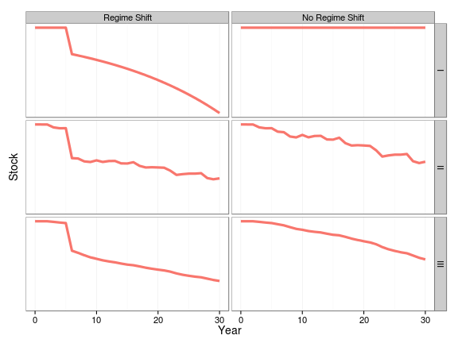

# Management Strategey Evaluation

## The Precautionary Approach

When managing fisheries decisions have to be made with incomplete knowledge. Therefore undesirable outcomes should be be anticipated; measures taken to reduce the risk of them occurring; corrective measures should be applied immediately and be effective within an acceptable time frame.

This requires limit and threshold reference points, used as part of a Harvest Control Rule. Consideration must be given to major uncertainties. e.g. in status of the stocks relative to reference points, biology, environmental events and the ability to implement management measures.

Harvest Control Rules will not necessarily be precautionary if they are not formally evaluated to determine how well they actually achieve their goals given uncertainty. Therefore often simulation is used to evaluate the impact of the main sources of uncertainty on the robustness of alternative HCRs and Management Strategies

## Management Procedures

Management Strategy Evaluation (MSE) is the use of simulation to evaluate the impact of uncertainty and reducing the risk, where risk is an uncertainty that matter. MSE allows a fuller consideration of uncertainty as required by the Precautionary Approach; provides stability if management objectives and how to evaluate how well alternative management strategies meet them are agreed through a dialogue between scientists and stakeholders; and can be used to guide the scientific process by identifying where the reduction of scientific uncertainty will improve management and so help to ensure that expenditure is prioritised to provide  the best research, monitoring and enforcement. 

MSE is also synonymous with the Management Proceedure (MP) approach, and is used to describe the process of testing generic MPs or harvest strategies. Under the MP approach a resource is managed using a fully specified set of rules incorporating feedback control; the approach is explicitly precautionary through its requirement for simulation trials to have demonstrated robust performance across a range of uncertainties about resource status and dynamics. MSE can also be used to identify the Value of Infomation (VoI) and the Value of Control (VoC), by simulation testing the elements of a management strategy given uncertainty, e.g. about the resource dynamics and our ability to implement management measures.

A management strategy is usually synonymous with MP but some authors use it to mean an a Harvest Control Rule (HCR) which is a set of well-defined rules used for determining management action in the form of a total allowable catch (TAC) or allowable fishing effort given input from an estimator or directly from data.

## Testing 

Conducting an MSE involves six steps, i.e.

+ **Identification** of management objectives and mapping these to performance measures to quantify how well they are achieved
+ **Selection** of hypotheses about system dynamics for building Operating Models, i.e. simulation models.
+ **Conditioning** the Operating Models on data and knowledge, and rejecting and weighting different hypotheses.
+ **Identifying** alternative management strategies, i.e.the combination of pre-defined data, stock assessment methods, reference points and HCRs.
+ **Running** the simulations using HCRs as feedback control procedures; and
+ **Agreeing** the Management Strategies that best meet management objectives.

 
```{r, eval=TRUE, echo=FALSE}
knitr::opts_chunk$set(echo = FALSE)

library(knitr)

opts_chunk$set(comment=NA, 
               warning=FALSE, 
               message=FALSE, 
               error  =FALSE, 
               echo   =FALSE, 
               eval   =!TRUE,
               fig.width =4, 
               fig.height=4)

iFig=0
iTab=0
```

# Management Objetives

The tuna Regional Fisheries Management Organisations (tRFMOs) use a common management framework based on target reference points, for example ICCATs Principles of Decision Making  are based on the framework

If a stock is in the Red Quadrant of the Kobe Phase Plot, i.e. it is overfished and overfishing is occurring then 


Then

+ management should ensure a high probability of ending overfishing in as short a time period as possible; and 
+ a plan must be adopted for rebuilding taking into account stock biology and SCRS advice

To do this requires the definition of

+ Risk Levels, Probabilities and Time Scales?
+ Short-term objective to stop overfishing,
+ Long-term objective to recover stock to a level that can support MSY


## Stop Overfishing


### Trade-offs between objectives

Objectives

+ Short-term to stop overfishing,
+ Long-term objective to recover stock to a level that can support MSY

Trade-offs

+ Short a time as possible?
+ Acceptable timeframe?


### Trade-offs between objectives

How Do The Recoveries Compare?

+ Takes 7 years for F to be reduced to target
+ Yield is higher initially but is less in the medium term
+ Stock recovery takes twice as long, 6 as opposed to 3 years


## Maintain healthy stocks

Management measures shall be designed to result in a high probability of maintaining the stock within the green quadrant


# Example

### Finance 

+ Invest the Capital and live off Interest, 
+ get a bank statement as required,
+ Investments can decrease as well as increase in value 

### Fisheries 
  
+ Keep the stock above $B_{MSY}$ and harvest the surplus
+ Only get a stock assessment once a year, if lucky!
+ Estimate of current stock status has large uncertainty  
+ What if environmental change recruitment? 

## Regime shift

Is it A or B?


It was A.


It took 20 years to work out that the stock had experienced a decline unrelated to fishing, however, we can not wait 20 years.

What to do? run an MSE and simulate two hypotheses, i.e.

+ No Change  or 
+ Change in Productivity

Thene valuate alternative management strategies i.e.

+ Constant Catch
+ 5\% of Assessed Stock Biomass
+ 80\% of Last Years Catch + 20\% of Catch under II

### Which Strategy is the most robust?

There are three main types of performance indicators, related to

+ Safety
+ Yield
+ Stability


Main objective is what happened to the stock?



Second objective what happened to yield?


Variability is more important than the expected.


### Take home message

+ Constant catch strategies are not robust
+ Catch is more variable under Strategy \textbf{II}
+ Risk of not being in the Green Quadrant?
+ Trade-offs between objectives?
+ Risk of stock assessment getting dynamics wrong and Regime Shifts, ...
+ How to prioritise funding to get appropriate research, monitoring and enforcement levels?


# Conditioning Operating Models

In the tRFMOs mainly done using stock assessment models. Modern stock assessment models have grown increasingly complex, however, and their development is limited to a priesthood of experts. In contrast Hilborn (2003) stated that he believed the future trend will be to base management decisions on simple rules that are more often data-based rather than model-based, while the complex models will serve primarily to evaluate the robustness of these decision rules.

To conduct MSE it is necessary to build a simulation model, i.e. an Operating Model, that represents the uncertainty about system dynamics. This requires the selection of hypotheses for the OM, conditioning the OM based on data and knowledge, and possible weighting and rejection of hypotheses.

The choice of hypotheses and how to weight them is critical, since once the OMs are chosen the "best" management procedure is determined, the task is to find it. There are many alternative ways to condition an OM. One approach is to use an Integrated stock assessment model like SS or Multifan-CL. 

The use of an assessment model as the OM implies that they can describe nature almost perfectly. If an assessment model can describe nature why bother with MSE? However, if a management procedure can not perform well when reality is as simple as implied by an assessment model it is unlikely to perform adequately for more realistic representations of uncertainty about resource dynamics. Basing an OM on the current assessment model also has arguably the lowest demands for knowledge and data and allows RFMOs to make a phased transition from the stock assessment paradigm to a risk based approach.

There are many important processes, however, that are not modelled in stock assessments and affect the robustness of control systems. Therefore to ensure a control system is robust also requires OMs to be conditioned based on expert beliefs and other a priori information about the processes that may affect the behaviour of management systems in the future. I.e. the focus is on the future, not on fitting historical data as when conditioning an OM on a stock assessment. This is a less data, and more hypothesis-orientated approach.

## ICCAT
## IOTC
## IATTC
## WCPFC
## CCSBT


### **Exercise:**                                             
http://rscloud.iccat.int:3838/swo-med/


# References
